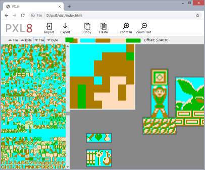

# PXL8
Browser-based CHR editor

## About PXL8

PXL8 is an in-development browser-based graphics editor for older video game 
consoles with character/sprite based graphics.

### Current Features

 * Edits NES graphics
 * Supports a predefined NES palette
 * Tile arranger
 * Copy and paste within the editor

### Planned Features

 * SNES and GB support
 * Multiple palettes
   * Possibly including the use of multiple palettes within the arranger
 * Arranger and palette persistence via one or both of:
   * Importing/exporting arranger layout as file (JSON)
   * Browser local storage
